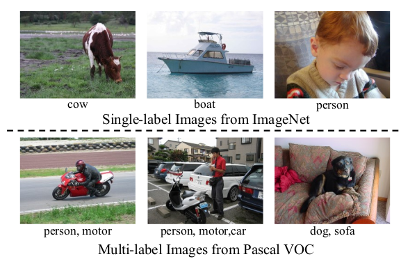

# Mutil Label Recognition项目

本项目旨在梳理和总结本人在**Mutil Label Recognition**方向的学习和工作

## 方向概述

个人理解：Mutil Label Recognition这个方向在于精确识别图片中的多类别物体，目前已经有一定的发展；然而，可以在**Partial Label**场景下对多标签图片进行高准确度的识别的方法仍在探索中，因此产生**Mutil Label Recognition With Partial Label**这条道路。目前，主要是以各种CNN特征提取网络作为Backbone，以寻找物体类别整体特征关联性为目标去探索新的框架和优化约束方法。

- 主流的Idea是基于以下来做的：**GCN、GGNN、Dictionary Learning、Transformer**，旨在挖掘标签之间的关联性

- 主流的辅助方法：共现矩阵、Word Embedding

- 主流的约束方法：**BCE、PBCE**

- 核心的优化方向：

  - **挖掘不同图片之间相同类别的物体特征的Similarity**

  - **挖掘相同图片内不同类别物体共现的概率**

    

			<!--块级封装-->
    
	<!--将图片和文字居中-->
    
     		<!--换行-->
    <b>
    Example	From DSDL（AAAI2022）<!--标题-->
    

## 更新列表-2023.03.26

- [ ] 方向脉络梳理
- [ ] 复现工作
  - [ ] DSDL（AAAI2021）
  - [ ] GCN-ML（CVPR2019）
- [ ] Our work

## 一、方向脉络梳理

**ing**..............................

## 二、复现工作

**ing**..............................

## Reference

**Thanks to：**

